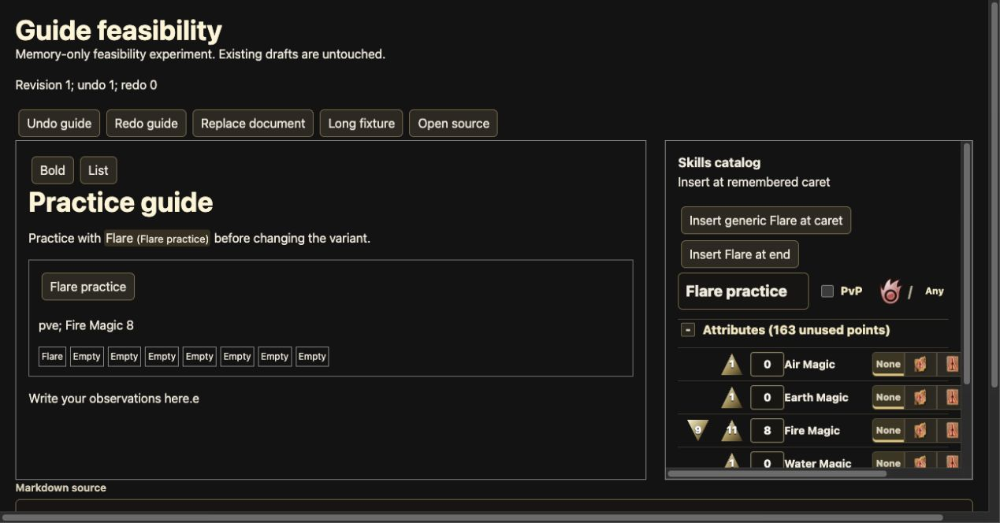

# SPRINT-021 execution evidence

Status: **implementation retained; BW-2001–BW-2007 done; required file-upload browser evidence blocked**.
See the [final acceptance mapping and B01–B10 matrix](evidence/SPRINT-021/phase12.md).
BW-2008–BW-2012, sprint and epic remain incomplete. The historical composition-only blockers below are superseded by the user amendment, not current blockers.
The [native composition verification deferral](evidence/SPRINT-021/native-composition-deferral.md)
records the exact decision and retained requirements. Native completion remains
unverified/deferred; it is not a passed test. No ticket is completed by this
amendment. The prior attempts and validation below remain historical evidence.
The outer runner retains commit ownership.

## Current phase evidence

- [Phase 1](evidence/SPRINT-021/resume2-phase1.md): accepted feasibility/contracts, actual native Undo, bounded capacity and dependency findings.
- [Phase 2](evidence/SPRINT-021/phase2.md): neutral semantic model and strict Markdown codec.
- [Phase 3](evidence/SPRINT-021/phase3.md): authoritative snapshots, source/history and temporary storage guard.
- [Phase 4](evidence/SPRINT-021/phase4.md): rendered writing and independent catalog shell.
- [Phase 5](evidence/SPRINT-021/phase5.md): complete cards, captured game-file IO and controls-only native history fix.

- [Phase 6](evidence/SPRINT-021/phase6.md): contextual references, repair and browser touch/atomic editing.

- [Phase 7](evidence/SPRINT-021/phase7.md): pointer and keyboard placement, cancellation and raw moves.
- [Phase 8](evidence/SPRINT-021/phase8.md): Source and inspected exports; file reimport gate remains open.
- [Phase 9](evidence/SPRINT-021/phase9.md): named records, exact recovery, mixed backups and storage failures.
- [Phase 10](evidence/SPRINT-021/phase10.md): Reader, variant navigation/copy, narrow/zoom and Source selection.
- [Phase 11](evidence/SPRINT-021/phase11.md): original dagger workflow, inspected download and frozen long fixture.
- [Phase 12](evidence/SPRINT-021/phase12.md): final matrix, native clipboard regression/fix, external drops, Network and legacy transfers.

These phase gates do not complete the file-upload/reimport rows. The exact [security restriction](evidence/SPRINT-021/upload-permission-gap.md) remains tracked. The sections
below are historical and do not supersede the current phase evidence.

## Resumed execution — 2026-09-27 UTC

Native Chrome access and native menu Undo now work. The composition trace still
ends with an untrusted `compositionend`, including in a plain uncontrolled
textarea. This leaves the full native completion gate unverified. The
[dated resume record](evidence/SPRINT-021/resume-20260927.md) preserves the exact
observations, two bounded history fixes, seven passing focused tests and the
combined resumed patch. No ticket is complete. The sections below preserve the
**initial attempt**; its permission denial is historical, not the current blocker.

## Initial attempt: environment and preconditions

- Execution date: 2026-09-26 America/New_York; records written 2026-09-27 UTC.
- Isolated worktree: `guide-workspace-burn/build-wars`; the main checkout was not modified.
- Base revision: `bbc162f4f8896ee7905aba8a03712fe31a098082` plus existing sprint-planning metadata.
- macOS 15.7.7 (24G720); installed Chrome 153.0.8010.54.
- Node 22.11.0; pinned npm 11.10.1; provisioned `.venv-data`.
- EPIC-01/04/05/06/09/16/18/19 inspected as done.
- Strategy: orchestrated, noninteractive, no commits. No planning/delegation lanes were run during execution.
- The skill weather curl failed with exit 6; strategy/model delegation was unnecessary.
- Package metadata required reviewed network execution; installation then passed.
- Localhost listen required reviewed execution; Vite served the isolated slice at `http://127.0.0.1:4173/?guide-feasibility`.

## Partial B01/B02 observations

These were actual Chrome tab interactions against the development experiment,
not final production acceptance. Browser actions were observed through the
accessibility tree. This is a summarized action record, not a raw browser trace.

| Action                                                                           | Observed result                                                                                       |
| -------------------------------------------------------------------------------- | ----------------------------------------------------------------------------------------------------- |
| Load paragraph, atomic Flare mention, complete build card and existing inspector | Rendered text and controls visible. Bound Flare reported 44 fire damage at Fire Magic 8.              |
| Place caret after the last paragraph and type ` Measured timing.`                | Text appended; typing grouped into one history entry.                                                 |
| Click existing Increase Fire Magic control                                       | Rank 8 → 9; bound mention changed 44 → 47 damage; undo count became 2.                                |
| Command-Z while inspector button retained focus                                  | Rank reverted to 8 and mention to 44; prose remained; undo 1 / redo 1.                                |
| Return caret to prose and Command-Z                                              | Typed suffix removed; undo 0 / redo 2.                                                                |
| Choose caret and click catalog insert                                            | One generic Flare appeared at the remembered caret; bound mention/card stayed unchanged.              |
| Arrow past mention and type ` after.`                                            | Neighboring text appeared after the atomic mention.                                                   |
| Open Source                                                                      | Complete Build v4/PvE budget/raw overlay and generic/local annotations appeared in the source buffer. |
| Request native Chrome app control                                                | Tool returned `Computer Use was not approved to use Google Chrome`.                                   |
| Approved tab Option-E followed by E                                              | Plain `e` appeared. No real composition was demonstrated; this does not pass IME acceptance.          |

At the initial attempt, the native access denial was the external blocker. No interactive resumption question was sent
under the noninteractive contract. Package/server tool escalations used automatic review. The exact resumption question is retained in
the result manifest. Native menu/beforeinput undo, actual composition and the
remaining browser matrix are unverified. No synthetic event is reported as proof.

## Experiment checks and artifacts

- [Deferred ADR and seam audit](../../compendium/decisions/0003-guide-editor-and-markdown-contract.md).
- [Recoverable experiment patch](evidence/SPRINT-021/feasibility-slice.patch) and [SHA-256](evidence/SPRINT-021/feasibility-slice.sha256).
- [Focused test output](evidence/SPRINT-021/feasibility-tests.txt): 5 passed, covering semantic snapshot/context round trip, literal/opaque sample, hostile JSON/conflict sample, chronological history/stale guards, and provisional capacity.
- [Typecheck](evidence/SPRINT-021/slice-types.txt): passed.
- [Lint](evidence/SPRINT-021/slice-lint.txt): passed with one Fast Refresh warning in the temporary entry route.
- [Baseline build](evidence/SPRINT-021/baseline-build.txt) and [experiment build](evidence/SPRINT-021/feasibility-build.txt): passed; chunk observations in ADR.
- [Dependency tree](evidence/SPRINT-021/dependency-tree.json) and [installation log](evidence/SPRINT-021/dependency-install.txt).
- [Single-process capacity observation](evidence/SPRINT-021/partial-capacity.json): provisional; no browser/storage budget accepted.

The patch preserves implementation progress without leaving a prototype route or
unaccepted dependency set in product code. It is based on the revision above and
contains known incomplete areas described in the ADR. Resumption must review it,
not treat it as production-ready. All five initially clean tracked product files
were restored; only experiment-created source files were removed. Existing
planning changes and unrelated files were preserved. Provisional packages were
pruned after restoring the manifests.

## Required matrix and ticket gates

| Matrix                  | Status                                                                 |
| ----------------------- | ---------------------------------------------------------------------- |
| B01 Writing/feasibility | Partial observations only; actual composition/native undo missing.     |
| B02 Catalog/layout      | Caret insertion observed; full responsive/scroll/theme matrix not run. |
| B03–B10                 | Not run; dependent implementation stopped at BW-2001.                  |
| BW-2001 acceptance      | Blocked; contracts, capacity and browser proof are not complete.       |
| BW-2002–BW-2012         | Not started; dependencies remain unsatisfied.                          |

No actionable sprint checkbox was checked: every phase checkbox bundles work
that still lacks at least one required proof. Final repository validation follows
cleanup and validates the retained documentation/evidence against the existing
application, not an implemented Guide workspace.

## Final validation

The final pinned `npm run verify` passed: formatting, lint, all TypeScript
projects, 587 Vitest tests, production build, 149 ingestion tests and 21 runner
tests. [Full output](evidence/SPRINT-021/final-verify.txt) is retained.

The [first verification attempt](evidence/SPRINT-021/verify-first-attempt.txt) hit
a 5-second timeout in the existing attribute-preview consumer test (586 other
tests passed). Its [focused rerun](evidence/SPRINT-021/attribute-preview-rerun.txt)
passed all five tests; the unchanged full command then passed all 587. No product
code or test timeout was changed to obtain the passing result.

`git diff --check`, archived-patch `git apply --check`, source/dependency restoration
and local evidence-link checks pass. [Dependency cleanup](evidence/SPRINT-021/dependency-cleanup.txt)
removed the 113 provisional packages. The initial offline prune without a lockfile
failed due to missing cached metadata; rerunning with the restored lockfile passed.

There are 68 actionable unchecked sprint items and zero checked items. The
[result manifest](../runs/ticket-burn/EPIC-20/20260926T232847Z/execute-SPRINT-021-result.json)
therefore records `blocked`, never `completed`. BW-2001 is blocked, BW-2002–BW-2012
remain backlog, and EPIC-20/sprint/ledger remain in progress. No commits were made.

## Current resume: BW-2001 gate passed

[Second-resume evidence](evidence/SPRINT-021/resume2-phase1.md) records the restored
combined slice, non-deferred actual-browser checks, grammar/capacity decisions
and 620 passing Vitest tests. BW-2001 is done; dependent implementation and final
B01–B10 verification are still in progress. Native composition completion,
cancellation and candidates remain **unverified/deferred by user decision**.

- [Phase 7 placement and clipboard](evidence/SPRINT-021/phase7.md): complete functional gate; 668 tests. Final integrated B03/B04 intake cases remain in BW-2012.

- [Phase 8 source and transfer](evidence/SPRINT-021/phase8.md): implementation and 674 tests passed; actual raw/applied downloads inspected. Required file reimport pending browser permission; BW-2008 remains in progress.
